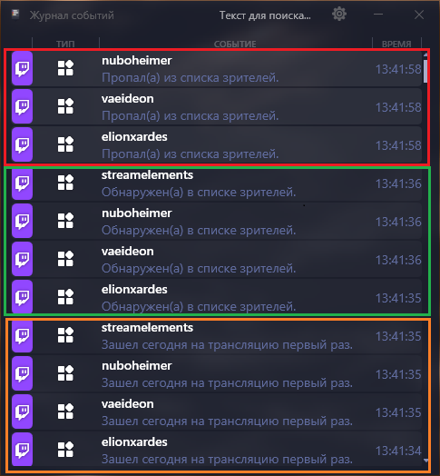

# TwitchService

Модуль для [streamer.bot](https://streamer.bot), расширяющий функционал взаимодействия со стриминговой площадкой [Twitch](https://www.twitch.tv).

## ⚠ Требования

- [Streamer.bot 0.2.8](https://streamer.bot/) Работоспособность в версиях выше не гарантируется. Ссылка ведёт на официальный сайт стримербота. Нужную версию можно найти в разделе загрузок.
- [Миничат 0.13.2](https://t.me/streamix_group/3). Ссылка ведёт на нужный раздел официальной группы в телеграм.
- [Интеграция](https://t.me/StreamfonyBot?start=_tgr_JpK_P4xlZmI6) между minichat и streamer.bot 0.1.5. Ссылка реферальная. Ведёт на приложение в телеграм. Интеграция находится в разделе "Плагины".
- [Прямая ссылка на интеграцию](https://t.me/StreamfonyBot/app?startapp=plugin_19-utm_share). (Ведёт в приложение телеграм).

## 🎯 Возможности

- Отправка в журнал событий minichat зрителя, впервые зашедшего на текущую трансляцию.
- Отправка в журнал событий minichat зрителя, зашедшего на трансляцию.
- Отправка в журнал событий minichat ушедшего зрителя.
- Игнорирование зрителя, написавшего в чат, до того как модуль пометил его "новым".
- Очистка списка "пришедших" зрителей.

## 🚀 Быстрый старт

### Первая установка
1. Импортируйте *TwitchService.txt* в streamer.bot.
2. Настройте **Present Viewers** для twitch.
3. Настройте под себя условия очистки списков и включения экшенов.

### Обновление с версии 1.0.3.
1. Импортируйте *TwitchService.txt* в streamer.bot.
2. Запустите два экшена через test trigger:
- **\[Twitch] Remove twitch_todays_viewers**
- **\[Twitch] Remove twitchLastViewersNameList**

## 📚 Подробные руководства
- **[Установка и обновление](docs/INSTALLATION.md)**
- **[Настройка и использование](docs/USAGE.md)**

## 🆘 Поддержка

- **Автор**: NuboHeimer
- **Личка Telegram**: [@nuboheimer](https://t.me/nuboheimer)
- **Группа Telegram**: [@nuboheimersb](https://t.me/nuboheimersb/30)
- **Email**: nuboheimer@yandex.ru
- **VK**: [vk.com/nuboheimer](https://vk.com/nuboheimer)

## 📄 Лицензия

Этот проект распространяется под лицензией [Creative Commons Attribution-NonCommercial-ShareAlike 4.0 International License](https://creativecommons.org/licenses/by-nc-sa/4.0/).

**Вы можете:**

- 🔄 **Делиться** — копировать и распространять код
- 🔧 **Адаптировать** — изменять, трансформировать и улучшать код

**При следующих условиях:**

- 📝 **Атрибуция** — Вы должны указать авторство
- 🚫 **Некоммерческое использование** — Материал нельзя использовать в коммерческих целях
- 🔗 **ShareAlike** — При изменении кода Вы должны распространять его под той же лицензией

Полный текст лицензии доступен в файле [LICENSE](LICENSE).
