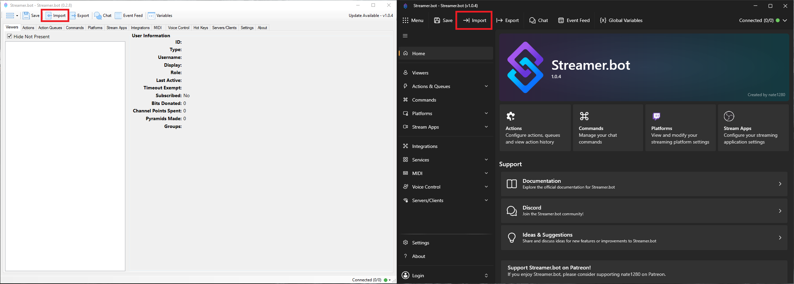
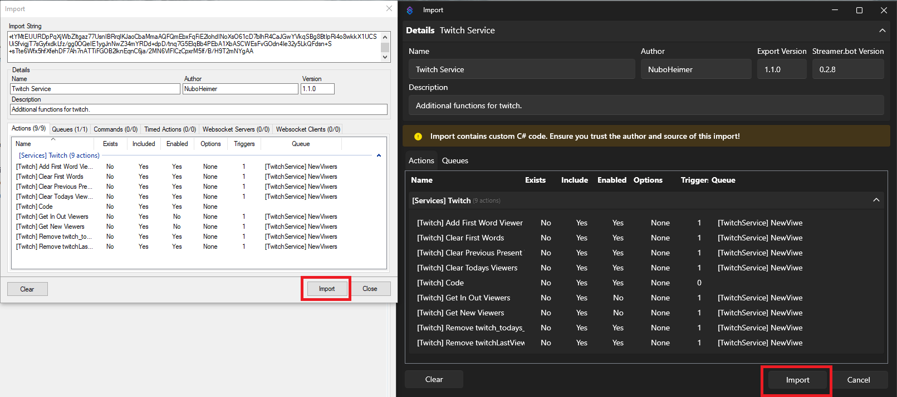
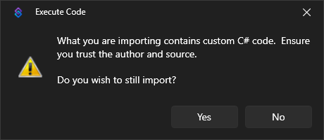
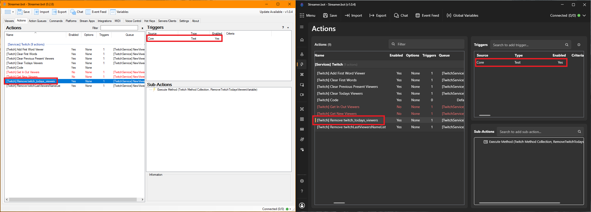
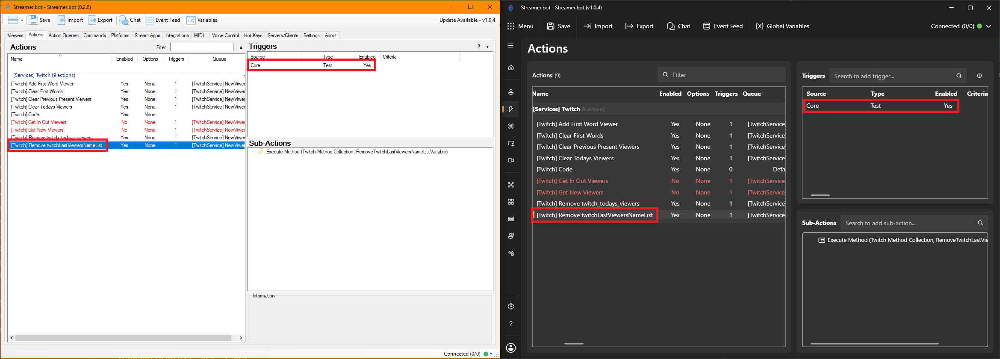

# TwitchService - Руководство по установке и обновлению.

## Установка.
1. Скачайте файл `TwitchService.txt` из последнего [релиза](https://github.com/NuboHeimer-for-streamers/TwitchService/releases/latest).
2. Запустите стримербот.
3. В верхнем меню нажмите кнопку `Import`.

  

4. Перетащите скачанный ранее `TwitchService.txt` в область `Import String`. Если перетащить не получается, откройте файл блокнотом, скопируйте текст и вставьте его в `Import String`.
5. Нажмите кнопку Import справа внизу.

  

5.1. Начиная с версии 1.0.0 Streamer.bot предупреждает, что вы импортируете кастомный C# код. Соглашаемся.

  

6. Установка завершена.

## Обновление с версии 1.0.3.
1. Запустите экшен **\[Twitch] Remove twitch_todays_viewers**

  

2. Запустите экшен **\[Twitch] Remove twitchLastViewersNameList**

  

Это нужно для удаления старых глобальных переменных, которые больше не используются.