# TwitchService - Руководство по использованию

## Disclaimer

Предполагается, что у вас уже есть установленная и настроенная интеграция с миничатом, а также настроенное подключение стримербота к твичу.

## Настройка стримербота.

1. Откройте раздел **Platforms -> Twitch -> Settings**.  

  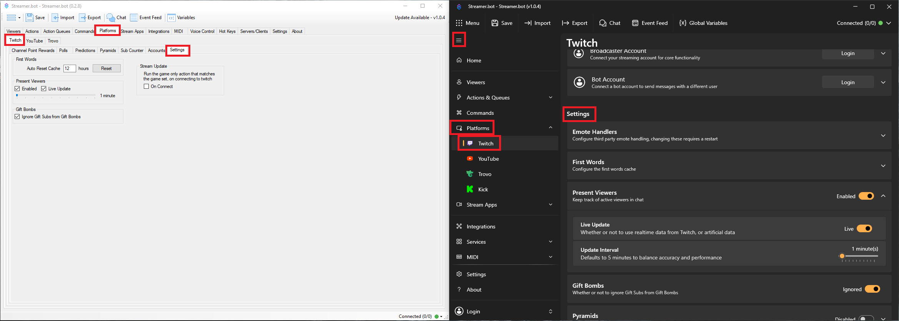

2. В разделе `Present Viewers` установите галочки:

- Enabled,
- Live Update.  
Ползунок установите на одну минуту.  

  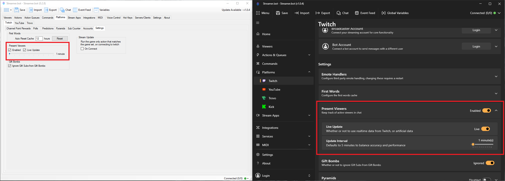

## Работа с экшенами.

### Общие рекомендации по триггерам

>⚠ Важно
>
> При перезапуске трансляции (падение и рестарт) стрим может интерпретироваться как новый.
> Чтобы избежать некорректной очистки списков и ошибок в определении зрителей, используйте более явный триггер: **OBS -> Streaming Started** или привязанную к запуску стрима горячую клавишу.

### \[Twitch] Add First Word Viewer

Экшен добавляет зрителя, написавшего в чат впервые за сегодняшнюю трансляцию, в список «впервые зашедших» зрителей. Это позволяет не отправлять событие в MiniChat для уже увиденных в чате зрителей.  

  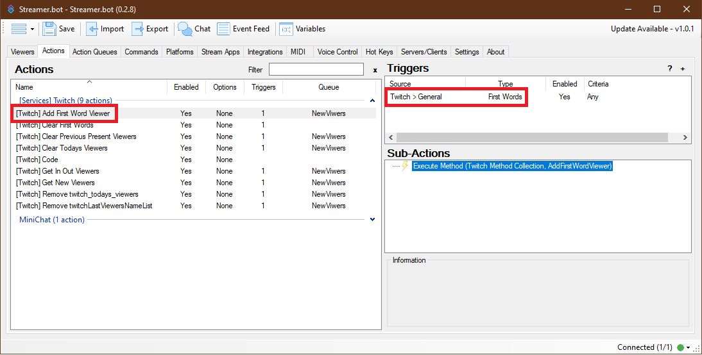

- Триггер: **Twitch -> General -> First Words**
- Используйте, если не хотите видеть событие в MiniChat для зрителей, написавших сообщение в чат. Если событие нужно — отключите этот экшен.

### \[Twitch] Clear First Words

Экшен очищает сохранённый список зрителей, для которых уже было зафиксировано событие **First Words**, чтобы на новой трансляции первые сообщения снова корректно считались «первыми».

  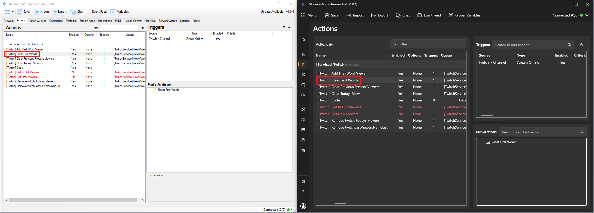

- Триггер: **Twitch -> Channel -> Stream Online**.

### \[Twitch] Clear Previous Present Viewers.

Экшен очищает сохранённый список **Present Viewers**, чтобы исключить устаревшие данные перед началом трансляции.  

  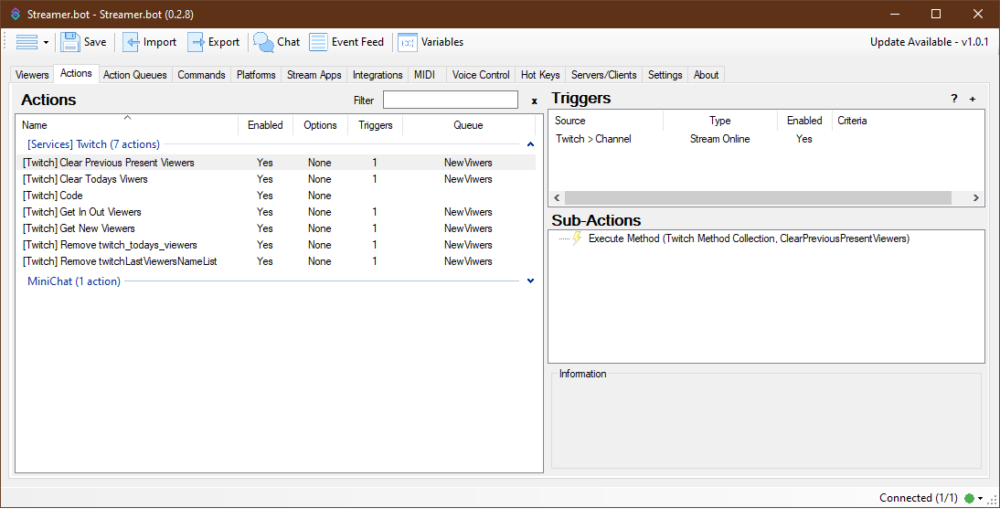

- Триггер по умолчанию: **Twitch -> Channel -> Stream Online**.
- Очищайте список перед запуском стрима, иначе в нём могут храниться устаревшие данные и зрители будут определяться неверно.
- Примечание: рекомендуется использовать тот же подход к выбору триггера, что и для очистки first words (см. блок «Важно» выше), чтобы избежать проблем при падении и рестарте трансляции.

### \[Twitch] Clear Todays Viewers.

Экшен очищает сохранённый список «сегодняшних» зрителей для корректного определения новых зрителей текущей трансляции.  

  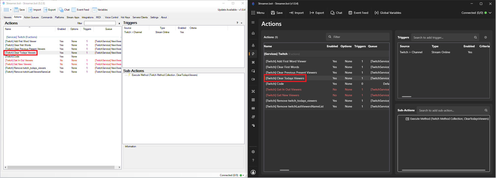

- Триггер: **Twitch -> Channel -> Stream Online**.
- Очищайте список перед запуском стрима, иначе могут сохраниться устаревшие данные и новые зрители будут определяться неверно.
- Примечания: рекомендуется заменить триггер на более явный, см. блок «Важно» выше.

### \[Twitch] Code

Служебный экшен с кодом. Так же в нём можно узнать текущую версию (указана в комментарии в сабэкшенах и в самом коде).  

  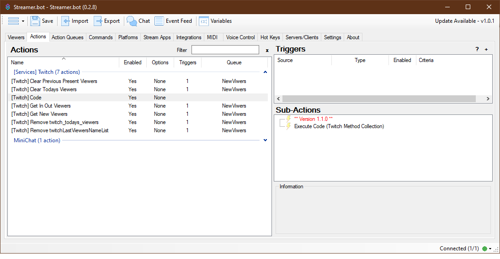

### \[Twitch] Get In Out Viewers

Экшен отправляет в MiniChat пользовательское событие о пришедшем или ушедшем зрителе. По умолчанию выключен. Заменяет собой функционал Get New Viewers.

  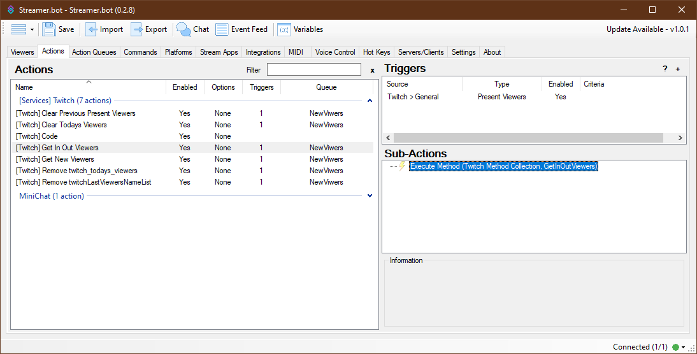

  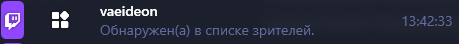

  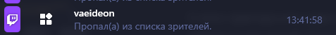

- Триггер: **Twitch -> Present Viewers**
- Пишет, когда зритель впервые зашёл на трансляцию.
- Пишет, когда зритель просто появился в списке зрителей (пришёл на трансляцию).
- Пишет, когда зритель пропал из списка зрителей (ушёл с трансляции).
- Примечания: требует корректной настройки **Present Viewers** и предварительной очистки списков перед началом трансляции.

### \[Twitch] Get New Viewers

Экшен отправляет в MiniChat пользовательское событие о новом зрителе на текущей трансляции. По умолчанию выключен. Если используете Get In Out Viewers, то оставьте выключенным.

  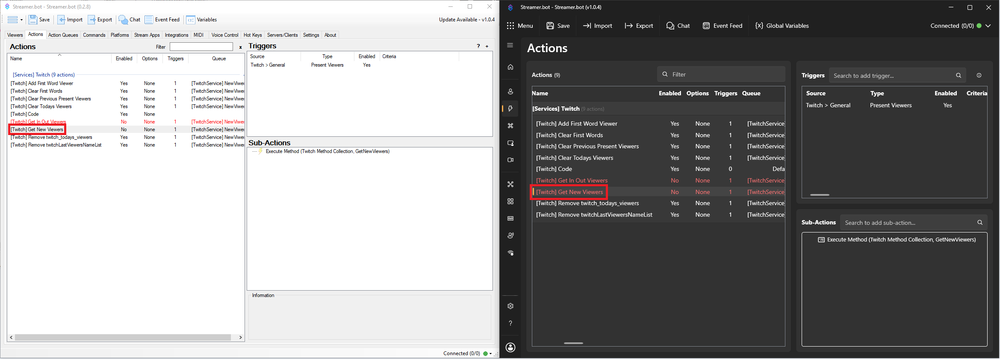

  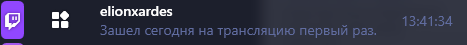

- Триггер: **Twitch -> Present Viewers**
- Примечания: требует корректной настройки **Present Viewers** и предварительной очистки списков перед началом трансляции.